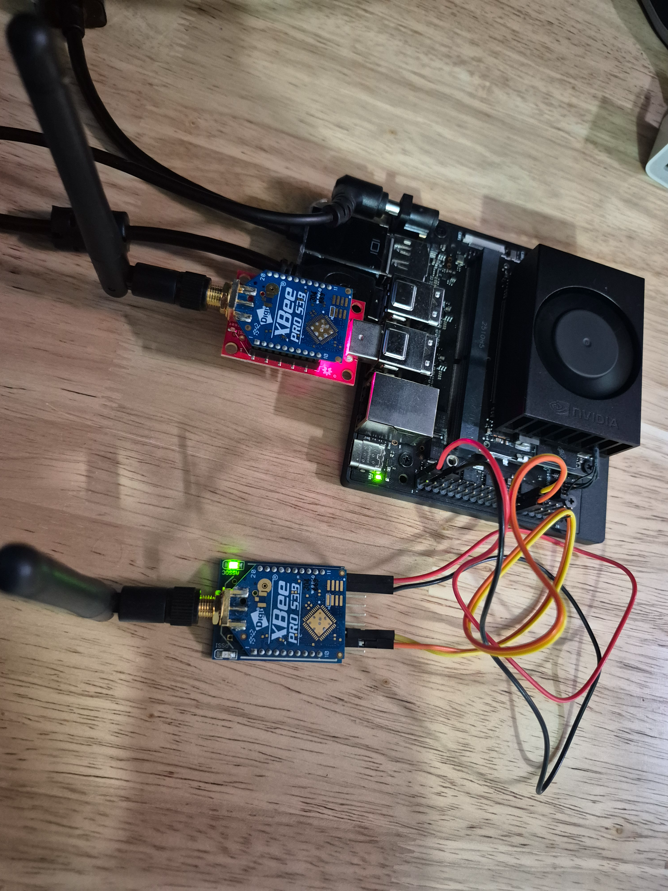

# Sensor Train

Motion telemetry for the Mission AI Possible train. An IMU on the locomotive
reports acceleration, rotation, heading, and pressure/altitude over an XBee
900 MHz radio link. A server on the demo network receives the stream and
serves it as JSON/SSE to the train's splash page.


```
 ┌─────────────── locomotive ───────────────┐                 ┌──────────── RHEL server ────────────┐
 │                                          │                 │                                     │
 │  Pololu AltIMU-10 v5 ──I²C──► Jetson     │   XBee-PRO      │  XBee dongle ──► xbee-receiver      │
 │  (LSM6DS33 / LIS3MDL /       Orin Nano   │   900HP (S3B)   │  /dev/ttyUSB0    container ──► HTTP │
 │   LPS25H)                    xbee-node ──┼──► DigiMesh ───►┤                  (UBI 9.4)    :8000 │
 │                              container   │   38400 baud    │                                 │   │
 └──────────────────────────────────────────┘                 └─────────────────────────────────┼───┘
                                                                                                ▼
                                                                                       splash page (JSON/SSE)
```

## Layout

| Path | What it is |
|---|---|
| [`Transmit/`](Transmit/ReadMe.md) | Telemetry node on the locomotive: reads the AltIMU over I²C and streams packets to the XBee. Runs as a UBI 9.4 container started by systemd. See its ReadMe for wiring, host checks, and boot setup |
| [`Receive/`](Receive/) | XBee → HTTP/JSON bridge on the RHEL server. Runs as a UBI 9.4 container managed by a Podman Quadlet unit |
| `xbee_config.py` | One-time setup for each XBee radio: sets baud and transparent mode, and optionally network ID, preamble, destination, and power |
| `20260928_101328.jpg` | Photo of the hardware setup |

## Hardware

- Pololu **AltIMU-10 v5**: LSM6DS33 accel/gyro (`0x6b`), LIS3MDL magnetometer (`0x1e`), LPS25H barometer (`0x5d`)
- **Jetson Orin Nano** Developer Kit (transmit side). An Arduino Nano version of the node also exists, see [Packet format](#packet-format)
- 2 × **Digi XBee-PRO 900HP (S3B, DigiMesh)** in USB (FTDI) dongles, one per side
- A RHEL host with Podman ≥ 4.4 for the receiver

## Quick start

### 1. Configure both radios

Plug each XBee dongle in, one at a time, and run:

```bash
pip3 install pyserial
python3 xbee_config.py --read                       # inspect, change nothing
python3 xbee_config.py --ni node --id 1AB4 --hp 0   # on the train radio
python3 xbee_config.py --ni pi   --id 1AB4 --hp 0   # on the server radio
```

The script always sets `BD=5` (38400 baud) and `AP=0` (transparent mode). The
other settings change only when you pass the flag for them. Both radios need the
same `ID` and `HP` values. Use `--broadcast`, or `--dh/--dl` with the other
radio's `SH/SL`, to set the destination. `--pl 1` lowers transmit power for
bench testing, and `--pl 4` is full power. Unplug and replug the dongle after
it's written.

### 2. Transmitter (Jetson)

Full steps are in [`Transmit/ReadMe.md`](Transmit/ReadMe.md). In short:

```bash
cd Transmit
docker build -t xbee-node:latest .
sudo cp transmit-note.service /etc/systemd/system/xbee-node.service
sudo systemctl daemon-reload && sudo systemctl enable --now xbee-node
```

### 3. Receiver (RHEL server)

```bash
cd Receive
podman build -t localhost/xbee-receiver:latest -f Containerfile .
sudo cp xbee-receiver.container /etc/containers/systemd/
sudo systemctl daemon-reload && sudo systemctl start xbee-receiver
journalctl -fu xbee-receiver
```

The bridge listens on port `8000`. The Quadlet publishes it on all interfaces.
To keep it local, change `PublishPort` to `127.0.0.1:8000:8000`.

## Configuration

### Transmitter (`xbee-node`)

| Variable | Default | Meaning |
|---|---|---|
| `I2C_BUS` | `7` | `/dev/i2c-N` for the AltIMU (`1` if wired to header pins 27/28) |
| `XBEE_PORT` | `/dev/ttyUSB0` | XBee dongle |
| `XBEE_BAUD` | `38400` | Must match the radios' `BD` setting |
| `RATE_HZ` | `50` | Packet rate. 38400 baud limits this to about 100 |
| `PRINT_DIV` | `0` | Print every Nth sample. `0` turns printing off |

### Receiver (`xbee-receiver`)

| Variable | Default | Meaning |
|---|---|---|
| `XBEE_PORT` | `/dev/ttyUSB0` | XBee dongle |
| `XBEE_BAUD` | `38400` | Must match the radios' `BD` setting |
| `HTTP_PORT` | `8000` | Port for the JSON/SSE server |
| `WINDOW` | `500` | Number of recent samples kept |
| `AXIS_MAP` | `x,y,z` | Remaps sensor axes to train axes for the chosen mounting orientation |

## Packet format

Every sample is one 35-byte little-endian frame:

```
offset  field    type     notes
0       sync0    u8       0xAA
1       sync1    u8       0x55
2       len      u8       30 (payload bytes, t_ms .. t_raw)
3       t_ms     u32      sender uptime in ms
7       seq      u16      increments per packet, wraps
9       ax..az   3×i16    accel raw,  0.061 mg/LSB   (±2 g)
15      gx..gz   3×i16    gyro raw,   8.75 mdps/LSB  (±245 dps)
21      mx..mz   3×i16    mag raw,    1/6842 G/LSB   (±4 G)
27      p_raw    i32      pressure,   p_raw / 4096 = mbar
31      t_raw    i16      temp,       42.5 + t_raw / 480 = °C
33      crc      u16      CRC-16/CCITT-FALSE (poly 0x1021, init 0xFFFF) over bytes 2..32
```

To decode it in Python:

```python
import struct
(s0, s1, n, t_ms, seq,
 ax, ay, az, gx, gy, gz, mx, my, mz,
 p_raw, t_raw, crc) = struct.unpack('<BBBIH9hihH', frame)
```

Sending `z` back over the link zeroes the altitude reference on the node.

## Troubleshooting

| Symptom | Check |
|---|---|
| Node logs that it's up, but the receiver sees nothing | Both radios need the same `ID` and `HP`, and both need `BD 5`. Run `xbee_config.py --read` on each |
| Receiver reports CRC errors | The baud rate doesn't match somewhere between the radio, node, and receiver |
| `no OK from the radio` from `xbee_config.py` | Another process (such as the container) has the port open. Stop it first |
| No devices in `i2cdetect -y -r 7` | Wiring problem, or the IMU is on a different bus. See `Transmit/ReadMe.md` §1–2 |
| Magnetometer readings wander | Expected. The traction motor's magnetic field dominates |

## Known gaps

The project is still being built. As of the initial commit:

- `Transmit/Containerfile`, `Transmit/requirements.txt`, `Receive/receiver.py`,
  `Receive/xbee_link.py`, and `Receive/ReadMe.md` are empty.
- `Transmit/app/node.py` holds the **Arduino sketch** (`altimu_xbee_node.ino`), not
  the Python node for the Jetson. The packet format above comes from it.
- `Receive/requirments.txt` is misspelled, but `Receive/Containerfile` copies
  `requirements.txt`, so the receiver build fails until the file is renamed.
- `Transmit/ReadMe.md` refers to `xbee-node.service`, but the file in the repo is
  `transmit-note.service`.
